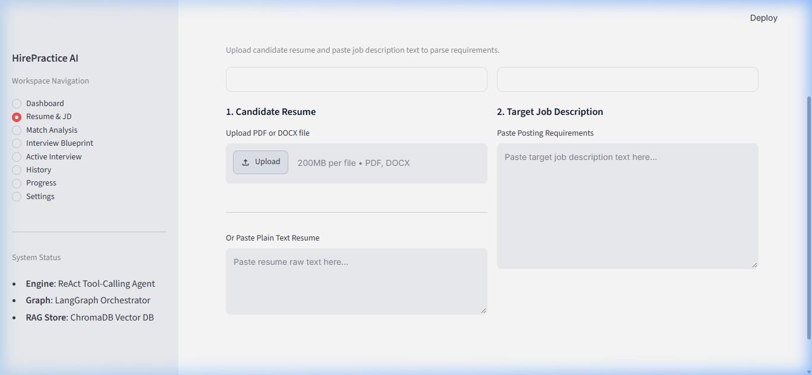
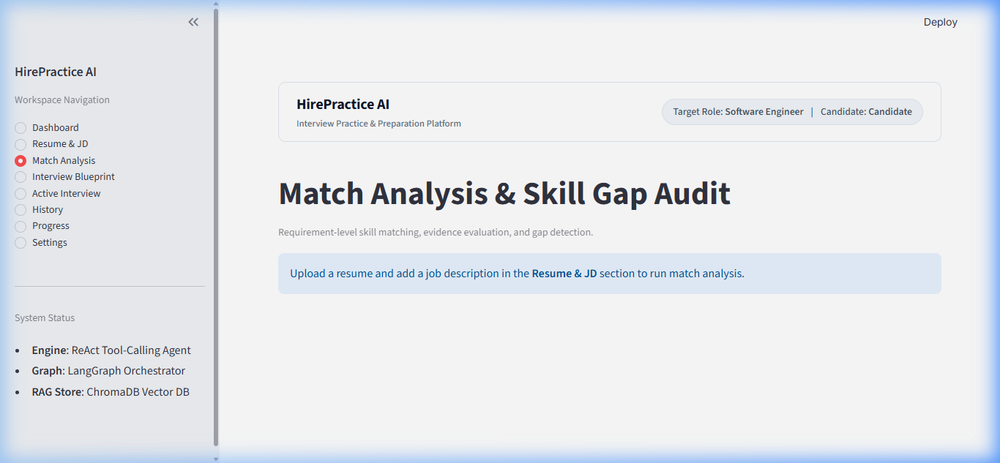
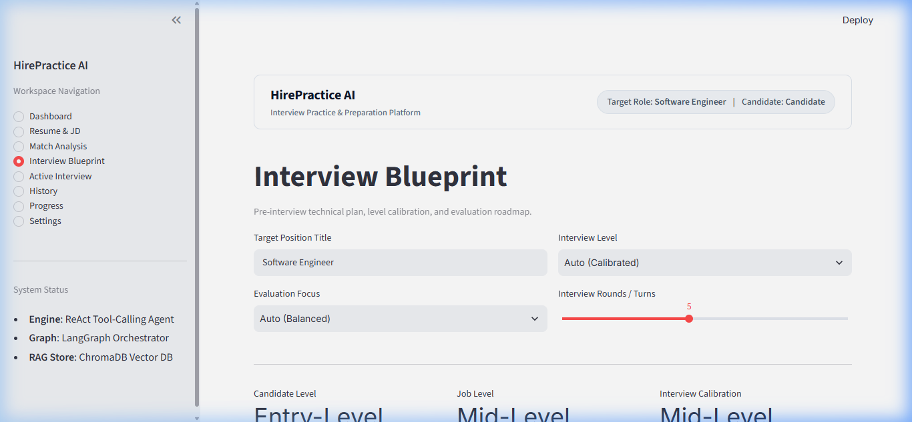
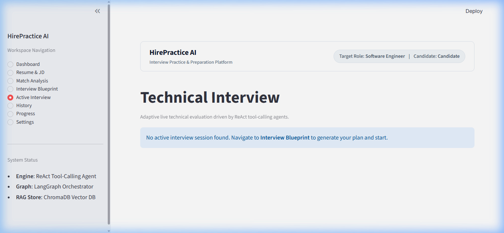
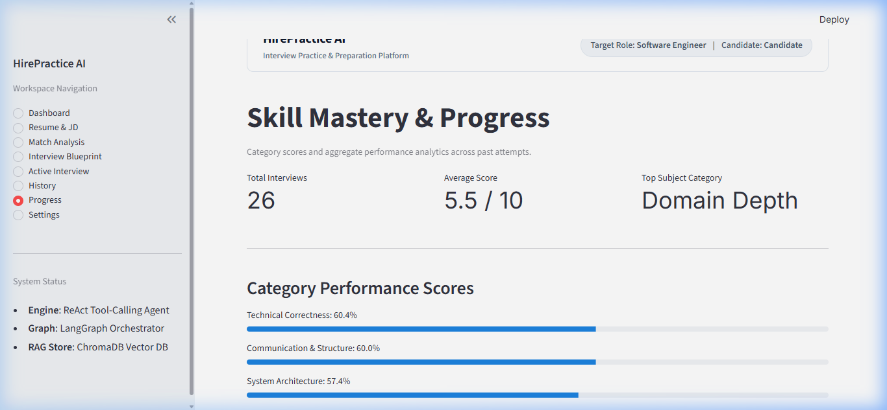
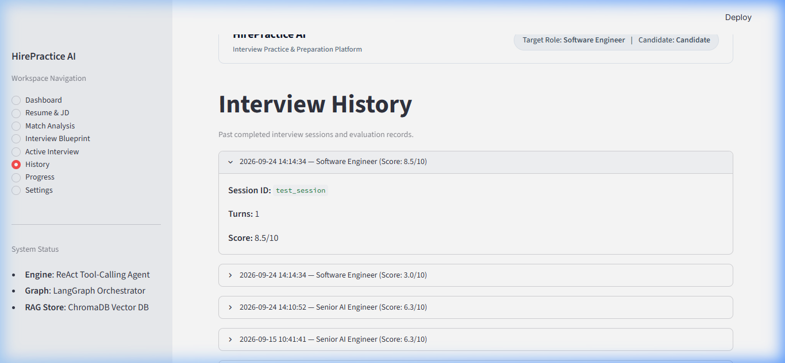
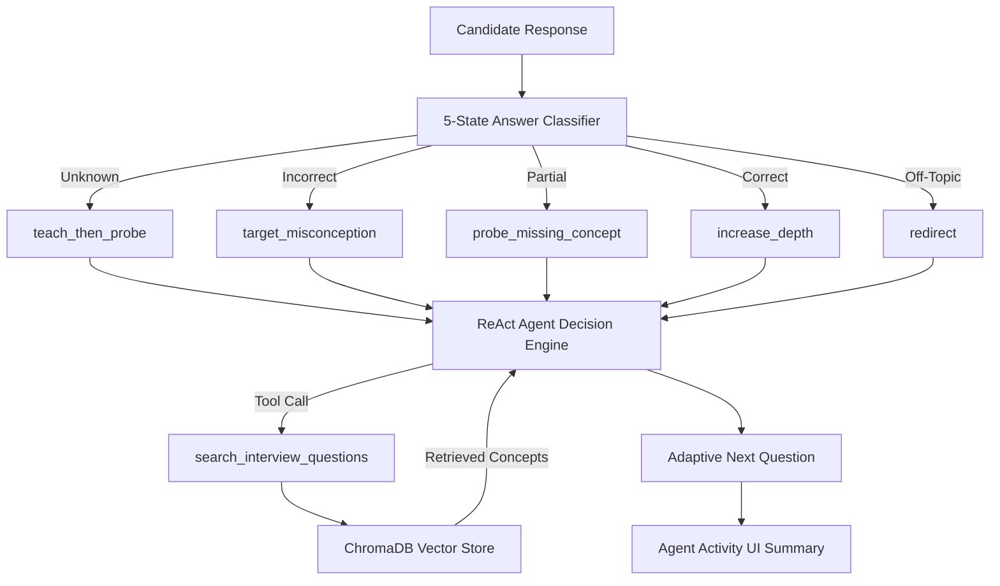
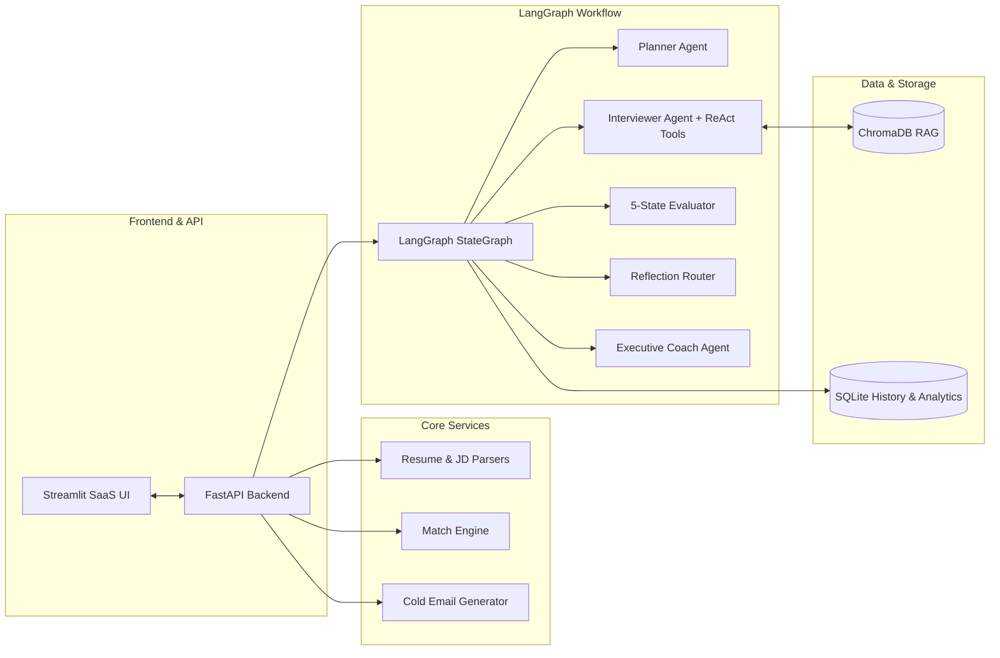

# 🎯 HirePractice AI — AI Mock Interview & Adaptive Career Coach

[](https://www.python.org/downloads/)
[](https://fastapi.tiangolo.com/)
[](https://github.com/langchain-ai/langgraph)
[](https://streamlit.io/)
[](https://www.trychroma.com/)
[](LICENSE)

> **From Resume Parsing & Job Description Matching to Adaptive ReAct Mock Interviews with 5-State Answer Classification.**

HirePractice AI is a production-oriented AI SaaS platform built with **LangGraph**, **FastAPI**, **ChromaDB RAG**, and **Streamlit**. It transforms raw candidate resumes and job descriptions into explainable match gap reports, targeted cold outreach emails, personalized interview roadmaps, and **adaptive AI technical interviews** that intelligently respond to candidate knowledge states.

---

## 🌟 Key Features

- **5-State Answer Classification Engine**:
  Classifies candidate responses into **5 distinct answer states**:
  - `unknown`: Triggers `teach_then_probe` adaptive follow-ups (*"No problem. Let's break it down..."*)
  - `incorrect`: Targets specific misconceptions (*"You mentioned X..."*)
  - `partial`: Probes missing concepts
  - `correct`: Increases question difficulty and technical depth
  - `off_topic`: Gently redirects back to the core technical question
- **ReAct-Style Agentic Tool Calling**:
  Real LLM tool execution loop where the Interviewer agent decides when to query the **ChromaDB vector store** (`search_interview_questions`) based on candidate performance and target skill gaps.
- **Safe Agent Activity UI Trace**:
  Renders clean, candidate-safe execution activity summaries in a collapsible expander (e.g., *"Checking question bank..."*, *"Targeting a knowledge gap..."*) without revealing raw chain-of-thought logic.
- **Explainable Resume-to-JD Match Engine**:
  Calculates a transparent match score (0–100%) with explicit breakdown: Required Skill Coverage (35%), Project Relevance (25%), Experience (20%), Preferred Skills (10%), and Education (10%).
- **Personalized 6-Round Interview Blueprint**:
  Generates a structured multi-round roadmap tailored to detected candidate skill gaps.
- **Automated Resume & JD Parsers**:
  Extracts candidate technical stack, experience, and projects alongside sanitized JD roles with zero prompt dumping.
- **Personalized Cold Outreach Email Generator**:
  Creates tailored job application email drafts based on resume + JD context with one-click copy.
- **SQLite History & Skill Analytics**:
  Saves interview sessions and tracks candidate performance improvement across technical skill categories over time.
- **LangSmith Observability**:
  Full tracing across LangGraph state execution, LLM calls, and tool invocations.

---

## 📸 Application Screenshots

| 🏠 Resume & JD Setup | 📊 Match Analysis |
| :---: | :---: |
|  |  |

| 🎯 6-Round Blueprint | 💬 Adaptive AI Interview |
| :---: | :---: |
|  |  |

| 📈 Category Progress | 📜 Session History |
| :---: | :---: |
|  |  |

---

## 🏛️ Adaptive ReAct Architecture



---

## 📊 5-State Classification Matrix

| Candidate Response | Answer Status | Evaluation Output | Adaptive Next Action |
| :--- | :--- | :--- | :--- |
| *"I don't know."* | `unknown` | `tech_score: 1`, `followup_strategy: teach_then_probe` | Breaks concept down into scenario-based learning probe |
| *"Lambda is cheaper and ECS doesn't scale."* | `incorrect` | `misconceptions: ["ECS can scale"]`, `followup_strategy: target_misconception` | Probes specific misconception with auto-scaling context |
| *"Lambda auto-scales, but ECS takes longer."* | `partial` | `knowledge_gaps: ["Cold starts vs task provisioning"]` | Asks probing question on missing concept |
| *"Lambda scales with requests, ECS uses task scaling policies..."* | `correct` | `depth_score: 8`, `followup_strategy: increase_depth` | Increases technical complexity & operational tradeoffs |
| *"I prefer working in Python for web dev."* | `off_topic` | `relevance_score: 1`, `followup_strategy: redirect` | Refocuses candidate on current question |

---

## 🏗️ Technical Architecture & Multi-Agent Graph



---

## 💻 Tech Stack

- **Frameworks & Multi-Agent**: [LangGraph](https://github.com/langchain-ai/langgraph), [LangChain](https://github.com/langchain-ai/langchain)
- **LLM Infrastructure**: Groq API (`llama-3.3-70b-versatile`), OpenAI (`gpt-4o-mini`), Google Gemini
- **Backend API**: [FastAPI](https://fastapi.tiangolo.com/), Uvicorn, Pydantic V2
- **Vector Database**: [ChromaDB](https://www.trychroma.com/) (RAG concept & question retrieval)
- **Frontend UI**: [Streamlit](https://streamlit.io/) (Clean Slate/Indigo SaaS layout)
- **Storage & Parsers**: SQLite3, pdfplumber, python-docx
- **Observability & Testing**: LangSmith, Pytest (100% pass rate across unit/integration tests)

---

## 🚀 Quick Start

### 1. Prerequisites
- Python 3.11+
- Groq or OpenAI API key

### 2. Installation & Setup

```bash
# Clone the repository
git clone https://github.com/ansh62949/AI-Mock-Interview-Coach.git
cd AI-Mock-Interview-Coach/mock-interview-ai

# Create virtual environment & install dependencies
python -m venv venv
source venv/bin/activate  # On Windows: venv\Scripts\activate
pip install -r requirements.txt

# Setup environment variables
cp .env.example .env
# Edit .env and add your GROQ_API_KEY or OPENAI_API_KEY
```

### 3. Run Application

```bash
# Terminal 1: Start FastAPI Backend Server
py -m uvicorn main:app --host 127.0.0.1 --port 8000

# Terminal 2: Start Streamlit Frontend Dashboard
py -m streamlit run ui/app.py --server.port 8501
```

Open your browser at:
- **SaaS Dashboard**: [http://localhost:8501](http://localhost:8501)
- **Interactive API Docs (Swagger)**: [http://127.0.0.1:8000/docs](http://127.0.0.1:8000/docs)

---

## 🐳 Running with Docker

```bash
# Build and run containers
docker-compose up --build
```

- Streamlit UI: `http://localhost:8501`
- FastAPI Server: `http://localhost:8000`

---

## 🧪 Running Automated Tests

Run the comprehensive test suite:

```bash
py -m pytest mock-interview-ai/tests -v
```

---

## 📁 Repository Structure

```text
AI-Mock-Interview-Coach/
├── Dockerfile
├── docker-compose.yml
├── .gitignore
├── README.md
└── mock-interview-ai/
    ├── agents/             # LangGraph Agents (Planner, Interviewer, Evaluator, Reflection, Coach)
    ├── database/           # SQLite Database & Session Persistence
    ├── graph/              # LangGraph Workflow State & Graph Definition
    ├── prompts/            # Agent Prompt Templates & System Prompts
    ├── rag/                # ChromaDB Vector Store & Retriever
    ├── schemas/            # Pydantic V2 Models & Data Schemas
    ├── services/           # Resume/JD Parsers, Match Engine, Cold Email, Tools
    ├── tests/              # Pytest Unit & Integration Suite
    ├── tools/              # ReAct Agent Tools (RAG Retrieval, Verification)
    ├── ui/                 # Streamlit UI SaaS Application
    ├── main.py             # FastAPI REST Server
    ├── requirements.txt    # Python Dependencies
    └── README.md           # Detailed Component Documentation
```

---

## 📄 License

This project is licensed under the MIT License - see the LICENSE file for details.
