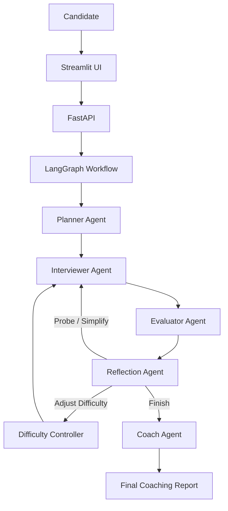
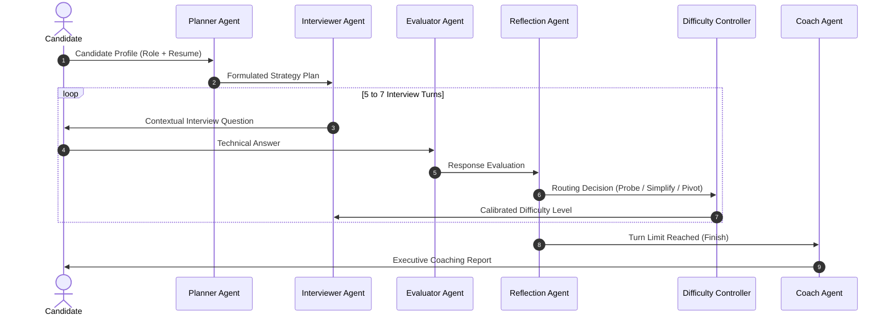

# AI Mock Interview Coach

A multi-agent AI interview platform built with **LangGraph**, **FastAPI**, and **Streamlit** that conducts adaptive technical interviews and generates structured coaching feedback.

Unlike traditional interview bots that follow a fixed sequence of questions, this system dynamically adjusts the interview based on candidate performance using multiple specialized AI agents.

---

## 🚀 Features

- **Multi-Agent Interview Workflow**: Specialized agents for planning, interviewing, evaluation, reflection, and coaching.
- **Adaptive Question Difficulty**: Dynamic question calibration (Junior, Mid-Level, Senior, Staff) based on live performance.
- **Resume-Aware Interviewing**: Contextual questions tailored directly to candidate projects and declared tech stacks.
- **Intelligent Follow-up Probing**: Probes deeper into weak or brief answers while enforcing fatigue limits (`probe_count <= 2`).
- **Structured Candidate Evaluation**: Scannable feedback structured into Summary and Actionable Improvement areas.
- **Coaching Report Generation**: Synthesizes top strengths, growth areas, and hiring recommendations upon completion.
- **LangGraph State Management**: State Graph workflow modeling non-linear routing decisions.
- **FastAPI REST API**: Scalable backend endpoints with automated OpenAPI documentation.
- **Streamlit Dashboard**: Modern UI with summary cards, difficulty badges, and report export.

---

## 🏛️ System Architecture



---

## 🔄 Interview Workflow



---

## 🤖 Multi-Agent Responsibilities

| Agent | Responsibility |
|---|---|
| **Planner Agent** | Analyzes candidate profile and resume to generate an interview strategy and topic syllabus. |
| **Interviewer Agent** | Conducts adaptive 1-on-1 interviews with contextual, resume-aware questions and zero prompt leakage. |
| **Evaluator Agent** | Assesses candidate responses objectively, assigning 1-10 scores and scannable feedback. |
| **Reflection Agent** | Determines adaptive graph routing (probe deeper, simplify, escalate difficulty, or finish). |
| **Difficulty Controller** | Manages current difficulty state (Junior, Mid-Level, Senior, Staff) across routing decisions. |
| **Coach Agent** | Synthesizes overall performance, key strengths, growth areas, and hiring recommendations into a final report. |

---

## 💻 Tech Stack

### Backend
- **Python 3.12**
- **FastAPI** & **Uvicorn**

### AI & Frameworks
- **LangGraph** (StateGraph Orchestration)
- **LangChain** & **LangChain OpenAI**
- **Groq API** (`llama-3.3-70b-versatile`) / **OpenAI** / **Gemini**

### Data Validation & Schemas
- **Pydantic V2** & **TypedDict**

### Frontend Dashboard
- **Streamlit**

### Automated Testing
- **Pytest** & **HTTPX TestClient**

---

## 🔄 LangGraph Flow Rationale

```text
Planner Agent ──> Interviewer Agent ──> Evaluator Agent ──> Reflection Agent ──> Difficulty Controller ──> Coach Agent
```

LangGraph was selected because the technical interview process is inherently non-linear. Based on the candidate's response quality, the Reflection Agent dynamically decides whether to probe deeper, simplify the question, increase or decrease difficulty, transition to a new topic, or conclude the interview. A graph-based workflow with conditional routing edges models this adaptive behavior naturally, whereas fixed sequential chains cannot adapt dynamically.

---

## 📝 Prompt Engineering

Each agent owns an independent system prompt file stored in the `prompts/` directory:

- **`prompts/planner.py`**: Syllabus definition and initial difficulty calibration rules.
- **`prompts/interviewer.py`**: Context-aware interviewing rules, strict anti-leakage directives, and candidate answer integration.
- **`prompts/evaluator.py`**: Objective scoring criteria (1-10) and structured bullet point feedback rules.
- **`prompts/reflection.py`**: Strategic routing logic with probe count limit enforcement.
- **`prompts/coach.py`**: Executive report synthesis rules.

Separating prompts from application code allows independent prompt iteration without modifying workflow orchestration.

---

## 🗃️ State Management

Centralized state is managed via `InterviewState` ([`schemas/state.py`](schemas/state.py)), leveraging `operator.add` reducers for cumulative sequences:

- **Candidate Profile**: `target_role`, `resume_summary`, `focus_area`.
- **Strategy & Plan**: `interview_strategy` (generated by Planner).
- **Transcript History**: `conversation_history` (cumulative list of interviewer and candidate messages).
- **Performance Evaluation**: `evaluations` (cumulative list of score and feedback records), `strong_areas`, `weak_areas`.
- **Routing & Control**: `current_difficulty`, `reflection_decision`, `follow_up_goal`, `follow_up_type`, `probe_count`, `turn_count`, `max_turns`.
- **Output Report**: `final_report` (generated by Coach).

---

## 💡 Design Decisions

- **Why LangGraph?** Technical interviews are non-linear conversations. Graphs with conditional routing model adaptive probing, difficulty scaling, and topic transitions cleanly.
- **Why Multiple Specialized Agents?** Isolates single responsibilities (planning vs. interviewing vs. evaluation vs. routing) for modular testing and clean code design.
- **Why Structured Outputs?** Enforces explicit JSON contracts between agents using Pydantic V2 schema models (`InterviewStrategy`, `EvaluationResult`, `ReflectionOutput`, `FinalReport`).
- **Why Separate Evaluator & Reflection Agents?** Decoupling objective scoring from strategic routing prevents prompt bias and enables deterministic routing rules (e.g. fatigue limits).

---

## ⚖️ Key Trade-offs

| Decision | Trade-off / Rationale |
|---|---|
| **No Inverted RAG Index** | Interview turns are brief (5-7 turns). In-memory TypedDict state provides sub-millisecond context retrieval without vector database overhead. |
| **In-Memory Session Storage** | Lightweight `SessionManager` used for fast local prototyping. Production deployment would swap in Redis or PostgreSQL. |
| **Streamlit Interface** | Chosen for rapid frontend iteration and clean candidate dashboard rendering. |

---

## 📂 Repository Structure

```text
mock-interview-ai/
├── agents/                  # Specialized agent implementations
│   ├── planner.py           # Strategy generation
│   ├── interviewer.py       # Contextual question generation
│   ├── evaluator.py         # Response scoring & feedback
│   ├── reflection.py        # Adaptive graph routing
│   ├── difficulty.py        # Difficulty state management
│   └── coach.py             # Final report synthesis
├── config/                  # Settings & environment configuration
│   └── settings.py
├── graph/                   # LangGraph workflow compilation
│   └── interview_graph.py
├── prompts/                 # System prompt templates
│   ├── planner.py
│   ├── interviewer.py
│   ├── evaluator.py
│   ├── reflection.py
│   └── coach.py
├── schemas/                 # Pydantic models & state definitions
│   ├── interview.py
│   └── state.py
├── tests/                   # Automated pytest suite (13 passing)
│   ├── test_agents.py
│   ├── test_api.py
│   ├── test_graph.py
│   └── test_schemas.py
├── ui/                      # Streamlit frontend dashboard
│   └── app.py
├── utils/                   # Shared LLM factory, session manager & logger
│   ├── llm.py
│   ├── session.py
│   └── logger.py
├── main.py                  # FastAPI REST web server
├── requirements.txt         # Production dependencies
├── .env.example             # Template environment file
├── .gitignore               # Git ignore rules
├── LICENSE                  # MIT License
└── README.md                # Project documentation
```

---

## 🔌 REST API Endpoints

FastAPI server exposes the following REST endpoints:

- `POST /api/interview/start`: Initializes a new interview session and returns initial question.
- `POST /api/interview/respond`: Accepts candidate answer, runs Evaluator $\rightarrow$ Reflection $\rightarrow$ Difficulty $\rightarrow$ Interviewer/Coach node updates, and returns the next question or final report.
- `GET /api/interview/status/{session_id}`: Retrieves current session state and transcript.
- `GET /health`: Server health check endpoint.

Access interactive Swagger documentation at **[http://127.0.0.1:8000/docs](http://127.0.0.1:8000/docs)**.

---

## 🧪 Automated Testing

The automated test suite verifies agent responses, Pydantic validation schemas, state graph execution, and REST endpoints:

```bash
# Run pytest suite
python -m pytest mock-interview-ai/tests
```
**Test Results**: **13 / 13 Passed**

---

## 🔮 Future Improvements

- **Voice Interview Interface**: Integrate real-time WebRTC audio streaming for spoken technical interviews.
- **Persistent State Backend**: Migrate session manager to Redis for distributed state scaling.
- **Multi-Model Benchmarking**: Compare candidate evaluation outputs across multiple LLM providers (Llama 3.3, GPT-4o, Gemini 1.5).

---

## 📄 License

Distributed under the MIT License. See [LICENSE](LICENSE) for details.
