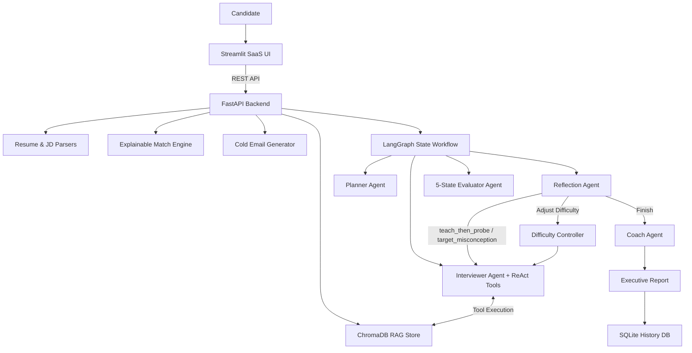

# HirePractice AI

> **From Resume Parsing & Job Description Matching to Adaptive ReAct Mock Interviews with 5-State Answer Classification.**

A production-oriented AI SaaS platform built with **LangGraph**, **FastAPI**, **ChromaDB RAG**, and **Streamlit** that transforms raw resumes and target job descriptions into adaptive, multi-agent mock technical interviews, explainable match gap scoring, personalized cold outreach emails, and historical progress tracking.

---

## 🚀 Key SaaS Features

- **Automated Resume Parsing & Profiling**: Extracts structured candidate profiles (skills, technologies, experience, projects, education, achievements) from PDF/DOCX resumes.
- **Job Description Analysis & Sanitization**: Extracts company, role title, required & preferred tech stack with regex sanitization to eliminate prompt/paragraph dumping.
- **Explainable Resume-to-JD Match Engine**: Computes transparent percentage match score (0-100%) broken down into Required Skill Coverage (35%), Project Relevance (25%), Experience (20%), Preferred Skills (10%), and Education (10%).
- **Personalized Cold Email Generator**: Creates targeted job application outreach emails based strictly on resume + JD context with download/copy functionality.
- **Personalized 6-Round Interview Roadmap**: Automatically plans customized interview rounds aligned with detected skill gaps.
- **ChromaDB RAG Retrieval Engine**: Queries local persistent ChromaDB vector store for technical domain concepts and question templates during interview generation.
- **5-State Answer Classification Engine**: Evaluates every candidate answer into one of 5 statuses:
  - `unknown`: Triggers learning/probing follow-up (`teach_then_probe`)
  - `incorrect`: Targets explicit misconceptions (`target_misconception`)
  - `partial`: Probes missing technical details (`probe_missing_concept`)
  - `correct`: Escalate difficulty/depth (`increase_depth`)
  - `off_topic`: Redirects back to core question (`redirect`)
- **ReAct Tool Execution Loop**: LLM dynamically decides when to invoke `search_interview_questions` tool, reads observation, and reasons over results to formulate adaptive technical questions.
- **Candidate-Safe Agent Activity UI Trace**: Displays user-friendly activity indicators (*"Checking question bank..."*, *"Targeting a knowledge gap..."*) in a collapsible drawer without leaking internal chain-of-thought prompts.
- **Multi-Agent LangGraph Workflow**: Specialized agents for planning, interviewing (RAG-grounded ReAct tools), 5-dimension evaluation, adaptive reflection, difficulty scaling, and executive coaching.
- **Granular 5-Dimension Evaluation**: Scores answers across Technical Correctness (/10), Depth (/10), Relevance (/10), Completeness (/10), and Communication (/10) with grounded improvement advice.
- **Persistent SQLite History & Progress Analytics**: Persists interview attempts and tracks real skill category progress over time.
- **FastAPI REST API & Docker Ready**: Clean endpoints, OpenAPI documentation, Dockerfile, and docker-compose deployment.

---

## 🏛️ System Architecture



---

## 📊 5-State Answer Classification & Adaptive Routing

```text
Candidate Answer
       ↓
Answer Classifier (Evaluator Agent)
       ↓
┌──────────┬──────────┬─────────┬──────────┬─────────┐
│ Unknown  │ Incorrect│ Partial │ Correct  │ OffTopic│
└────┬─────┴────┬─────┴────┬────┴────┬─────┴────┬────┘
     ↓          ↓          ↓         ↓           ↓
   Probe     Fix Gap     Probe     Harder      Redirect
     ↓          ↓          ↓         ↓           ↓
             ReAct Decision Engine
                    ↓
        search_interview_questions()
                    ↓
                ChromaDB
                    ↓
             Next Question
```

### Classification Details

| Status | Tech Score | Follow-up Strategy | Example Candidate Input | System Adaptive Behavior |
| :--- | :--- | :--- | :--- | :--- |
| `unknown` | 1/10 | `teach_then_probe` | *"I don't know."* | *"No problem. Let's break it down. Imagine traffic suddenly increases 100x..."* |
| `incorrect` | 2-3/10 | `target_misconception` | *"Lambda is cheaper and ECS doesn't scale."* | *"You mentioned ECS doesn't scale. ECS actually uses Service Auto Scaling..."* |
| `partial` | 4-6/10 | `probe_missing_concept` | *"Lambda automatically scales with requests."* | *"Good, but what happens during sudden traffic spikes regarding cold-start latency?"* |
| `correct` | 7-10/10 | `increase_depth` | *"Lambda scales per request while ECS uses task policies..."* | *"Great response. Now assume 10,000 req/sec continuously. Which would you choose?"* |
| `off_topic` | 1/10 | `redirect` | *"I really like working with Python frameworks."* | *"Let's focus back on the infrastructure question regarding AWS Lambda vs ECS..."* |

---

## 🔄 Core Product Workflow

```text
STEP 1: Upload Resume (PDF/DOCX)
        ↓
STEP 2: Add Target Job Description (Text/File)
        ↓
STEP 3: AI Resume-JD Match Analysis (Score & Skill Gap Breakdown)
        ↓
STEP 4: Personalized Cold Email Generation (Outreach Acceleration)
        ↓
STEP 5: Personalized 6-Round Interview Roadmap
        ↓
STEP 6: Start AI Mock Interview (ChromaDB RAG Grounded + ReAct Tools)
        ↓
STEP 7: 5-State Answer Evaluation & Adaptive Routing
        ↓
STEP 8: Executive Coaching Report Generation
        ↓
STEP 9: SQLite History Persistence & Category Progress Dashboard
```

---

## 💻 Tech Stack

### Backend & AI Architecture
- **Python 3.11+**
- **FastAPI** & **Uvicorn**
- **LangGraph** (StateGraph Multi-Agent Orchestration)
- **LangChain** & **LangChain OpenAI / Google GenAI**
- **ChromaDB** (Local Persistent Vector Database for RAG)
- **Groq API** (`llama-3.3-70b-versatile`) / **OpenAI** (`gpt-4o-mini`) / **Gemini**
- **SQLite** (Session History & Analytics Database)
- **LangSmith** (LLM & Tool Observability)

### Parsers & Utilities
- **pdfplumber** & **pdfminer.six** (PDF parsing)
- **python-docx** (DOCX parsing)
- **Pydantic V2** (Strict schema validation)

### Frontend Dashboard
- **Streamlit** (Clean Slate/Indigo SaaS Dashboard interface)

---

## 🔌 REST API Endpoints

- `POST /api/resume/upload`: Uploads resume PDF/DOCX and returns extracted Candidate Profile + Analysis.
- `POST /api/resume/parse-text`: Parses raw text resume into Candidate Profile.
- `POST /api/jd/analyze`: Parses Job Description into structured Job Profile.
- `POST /api/match/analyze`: Computes explainable % match score and skill gap breakdown.
- `POST /api/cold-email/generate`: Generates targeted cold outreach email.
- `POST /api/interview/start`: Initializes LangGraph interview state and returns initial RAG-grounded question.
- `POST /api/interview/respond`: Evaluates candidate answer across 5 dimensions and routes to next question or final report.
- `GET /api/interview/status/{session_id}`: Retrieves active interview session state.
- `GET /api/history`: Retrieves list of past saved interview sessions.
- `GET /api/progress`: Retrieves category progress analytics across attempts.
- `GET /health`: Server health check endpoint.

Access interactive Swagger API documentation at **[http://127.0.0.1:8000/docs](http://127.0.0.1:8000/docs)**.

---

## 🚀 Running Locally

```bash
# 1. Clone repository
git clone https://github.com/ansh62949/AI-Mock-Interview-Coach.git
cd AI-Mock-Interview-Coach/mock-interview-ai

# 2. Configure environment keys in .env
cp .env.example .env

# 3. Start FastAPI Backend Server
py -m uvicorn main:app --host 127.0.0.1 --port 8000

# 4. Start Streamlit SaaS Frontend Dashboard (in a new terminal tab)
py -m streamlit run ui/app.py --server.port 8501
```

---

## 🐳 Running with Docker

```bash
# Build and run multi-container service (FastAPI + Streamlit + ChromaDB)
docker-compose up --build
```

Access services at:
- **Streamlit SaaS UI**: [http://localhost:8501](http://localhost:8501)
- **FastAPI REST API**: [http://localhost:8000](http://localhost:8000)

---

## 🧪 Running Automated Tests

Run the complete test suite:

```bash
py -m pytest tests -v
```

All 35 unit & integration tests pass with 100% success rate.

---

## 📄 License

Distributed under the MIT License.
